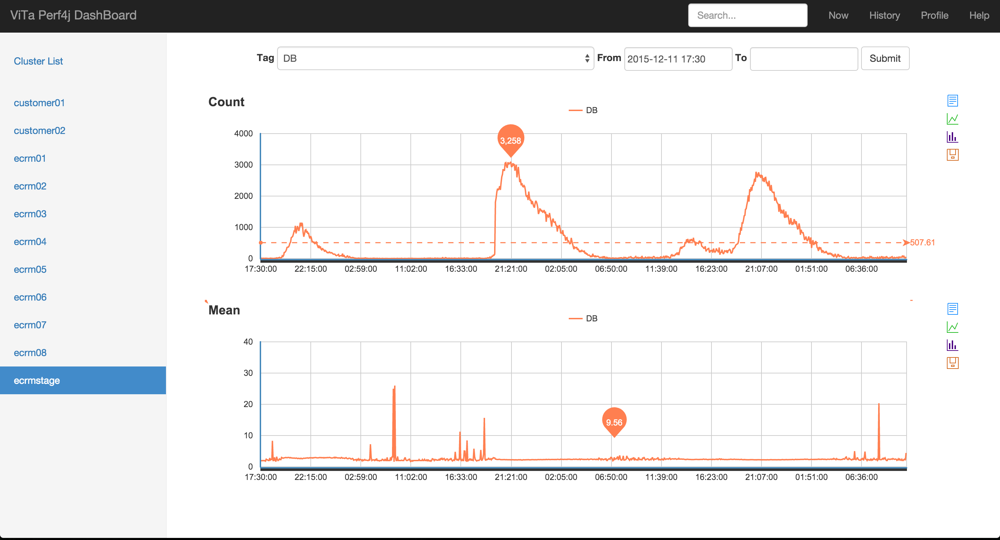
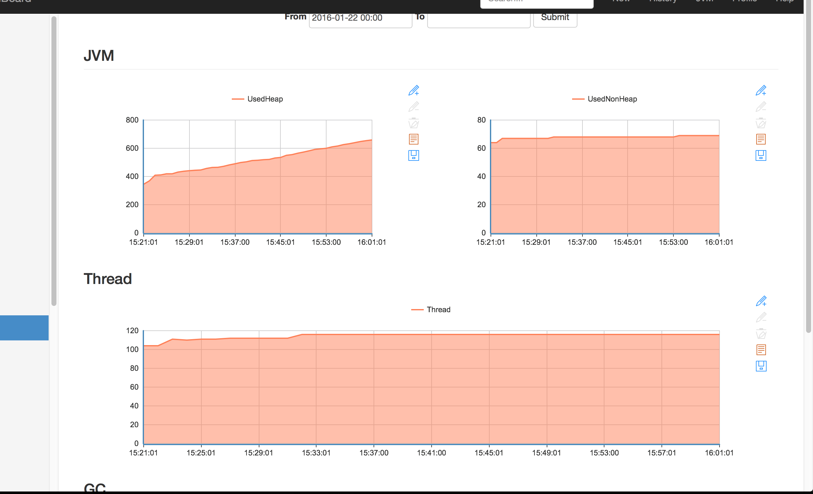

# perf4j

Perf4J 是一个开放源码的性能记录，监测和分析库，主要用于企业Java应用程序。

perf4j-zh 是修改部分perf4j源码并加入机器集群监控，使perf4j能够被更多企业Java项目使用。

## perf4j-zh、 perf4j 

1. perf4j-zh重写per4j的图表渲染，由google的chartApi改为baidu的Echart图表，在google被墙的今天，使其更适合国内的使用行情。
1. 性能数据采集与数据渲染进行分离,方面对接到本公司内部的监控系统
1. 增加集群监控项目`perf4j-dashboard`，使其可以渲染出集群中每台服务的性能图表。
1. 支持实时监控和历史监控图表渲染,快速帮助开发者分析系统的瓶颈、问题,节省人力
1. 和其它监控对比最大的特点：简单、实用、开箱即用

下面这几张图表是其在一个实际业务项目中，集群服务的监控图表

**实时监控**

**历史数据**

**基本JVM监控**

## 快速上手

*注意：*如果你正在使用Windows平台，下面的步骤也许不适合Windows平台，这需要你研究下面每一步的意思，自己手动完成每一步的操作

**1.在本地构建安装**

首先你需要在本地将`2.0-SNAPSHOT`版本的perf4项目install到你本地，你只需要执行下面脚本

    sh ./build.sh
    
__注意：__线上mvn私服是不存在这个2.0-SNAPSHOT版本的perf4j包，该脚本主要目的是安装该版本的perf4j到你本地的maven私服中，新版本的perf4j使用方式完全和原官网的perf4j一样，
它只是有少量的对perf4j内部源码的修改，不会涉及到用户使用层的接口，所以当你的项目原本就依赖perf4j时，你可以直接把依赖包升级到`2.0-SNAPSHOT`，而不必修改任何配置和其它使用到perf4j的地方。
    
**2.启动集群监控项目perf4j-dashboard**
    
    cd perf4j-dashboard
    mvn jetty:run
    
启动完毕后访问：[127.0.0.1:8889](http://127.0.0.1:8889) ，你也可以更改端口号，通过修改 perf4j-dashboard/pom.xml下面的配置
    
    <properties>
        <jetty.stop.port>10000</jetty.stop.port>
        <jetty.run.port>8889</jetty.run.port>
    </properties>

**3.运行perf4j-demo演示项目**

此时，在dashboard项目中不会有任何监控图表，因为还没有任何依赖perf4j的项目在运行，perf4j-demo就是一个用于演示的demo项目，它引入了perf4j依赖，通过同样方式启动
在这个演示项目中，它会监控接口的请求TPS、响应时间和固定实际内的请求数
 
    cd perf4j-demo
    mvn jetty:run
    
启动成功后，需要不断的访问演示项目，使其产生请求量
    
    sh ./test.sh

然后在去刷新观察perf4j-dashboard项目，监控图表便会展现 
   
   
## 具体使用介绍

1. [perf4j与dashboard配合使用说明文档](./doc/usage.md)
1. [perf4j架构解析](https://raw.githubusercontent.com/WangJunTYTL/perf4j-zh/master/doc/perf4j架构解析.jpg)
1. [常见问题](./doc/qa.md)
1. [perf4j解读](./doc/perf4j_src.md)

## 交流

QQ群：365133362 群名称：互联网从业者
   
   
