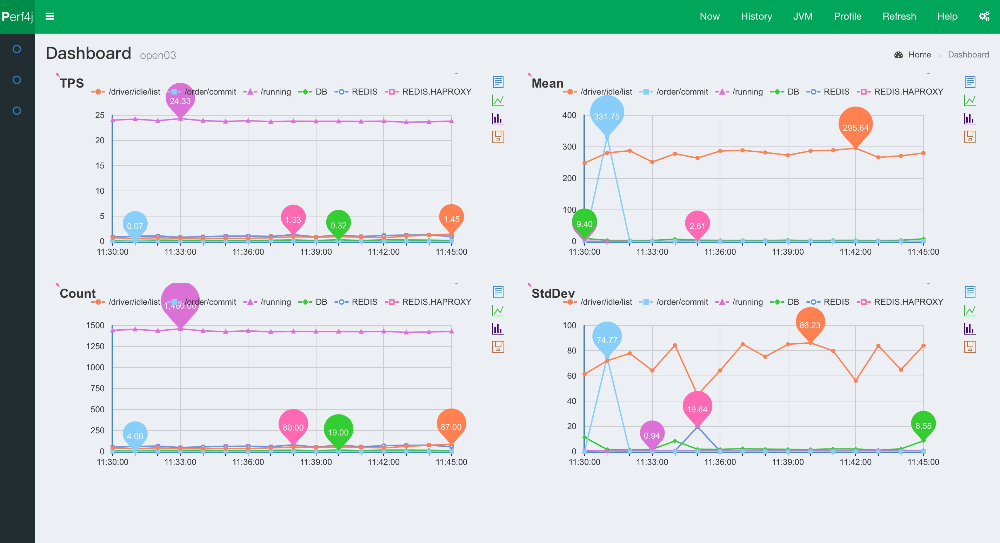
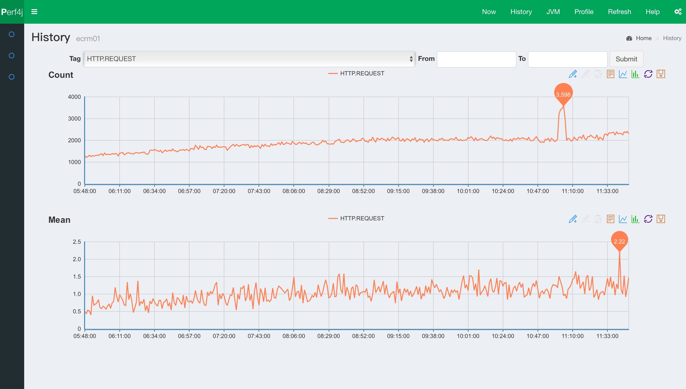
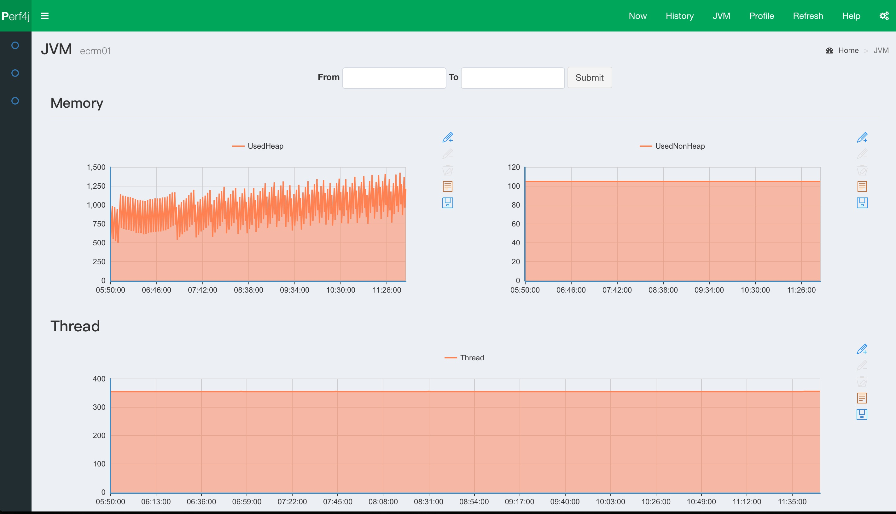

# perf4j

Perf4J 是一个开放源码的性能记录，监测和分析库，可以把根据埋点计算服务的TPS、Mean、Count、Max、Min、StdDev 6种指标值，主要用于企业Java应用程序。

perf4j-zh 是修改部分perf4j源码并加入机器集群监控项目Dashboard，使perf4j能够被更多企业Java项目使用。

## perf4j-zh、 perf4j

1. perf4j-zh重写per4j的图表渲染，由google的chartApi改为baidu的Echart图表，在google被墙的今天，使其更适合国内的使用行情。
1. 性能数据采集与数据渲染进行分离,方面对接到本公司内部的监控系统
1. 增加集群监控项目`perf4j-dashboard`，使其可以渲染出集群中每台服务的性能图表。
1. 支持实时监控和历史监控图表渲染,快速帮助开发者分析系统的瓶颈、问题,节省人力
1. 和其它监控对比最大的特点，主要定位于业务监控：简单、实用、开箱即用

下面这几张图表是其在一个实际业务项目中集群服务的监控图表

#### 实时监控

#### 历史数据

#### 基本JVM监控

## 快速上手

### 下载项目

git clone https://github.com/WangJunTYTL/perf4j-zh.git

### 开始构建

**注意：** 如果你正在使用Windows平台，请按照`build.sh`脚本的步骤手动执行

构建perf4j-zh到你本机，通过执行下面脚本快速完成

    sh ./build.sh

### 启动dashboard
    
    cd perf4j-dashboard
    mvn jetty:run
    
启动完毕后访问：[127.0.0.1:8889](http://127.0.0.1:8889)，此时没有任何数据，接着需要启动演示项目demo

### 启动demo演示项目

监控接口的请求TPS、响应时间
 
    cd perf4j-demo
    mvn jetty:run
    
启动成功后，需要不断的访问demo项目，目的是模拟产生请求量，在Dashboard中观察demo项目的请求TPS和响应时间
    
    sh ./test.sh

然后在去刷新观察dashboard
   
## 版本升级

`注意：`上述构建时会构建一个2.0-SNAPSHOT版本的perf4j包如果你正在使用0.9.16版本或更低版本的包请升级，另外如果你们

1. 增加了`SqlLiteAppender`，该Appender可以支持把按时间单元分析后性能数据结果导入到SQLite文件中
1. 内部图表数据结构改变了，不在调用Google的ChartApi，改为把分析好的性能数据结果以Json格式输出
1. 增加了通过HTTP方式查询性能数据的API接口

最新版本中只有内部功能的更新，不会涉及到用户使用层的接口，所以当你的项目原本就依赖perf4j时，你可以直接把依赖包升级到`2.0-SNAPSHOT`

## perf4j-zh说明文档

有关perf4j的节本介绍，大家可以直接在网上搜索，或者下载后查看 ./perf4j-zh/doc/site/index.html

1. [性能数据采集配置](./doc/perf4j_usage.md)
2. [dashboard配置](./doc/dashboard_usage.md)
3. [perf4j架构解析](https://raw.githubusercontent.com/WangJunTYTL/perf4j-zh/master/doc/perf4j架构解析.jpg)

## 最近更新

### 2016-04-26

1. 更新dashboard项目的UI风格，导航栏可以按照集群进行折叠
2. 优化History页面的加载速度
3. 增加机器索引页面，可以快速定位机器
4. 更改配置方式，废弃之前通过配置文件添加机器的方式，可以直接在web页面中管理机器

### 2016-03-21

1. 修复Windows下的构建的找不到git.cmd错误的bug

## 交流

QQ群：365133362 群名称：互联网从业者
   
   
