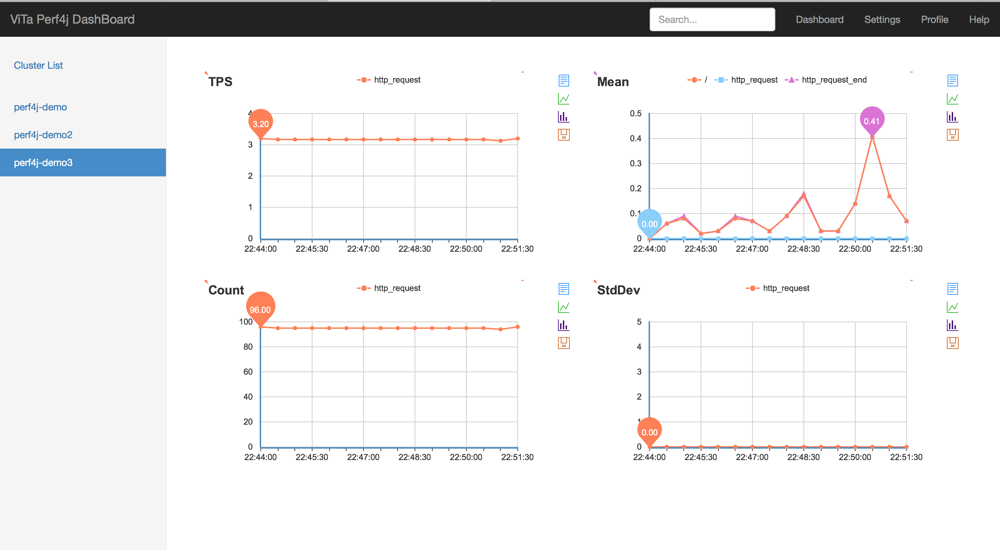

# perf4j

Perf4J 是一个开放源码的性能记录，监测和分析库，主要用于企业Java应用程序。

perf4j-zh 是修改部分perf4j源码并加入集中式机器集群监控图表，使perf4j能够被更多企业Java项目使用。


## perf4j-zh、 perf4j 

1. perf4j-zh重写per4j的图表渲染，由google的chartApi改为baidu的Echart图表，在google被墙的今天，使其更适合国内的使用行情。
1. 增加集群监控项目`perf4j-dashboard`，使其可以渲染出集群中每个服务的性能图表。

下面这张图表是其在一个实际业务项目中，perf4j-dashboard对集群服务的监控样式




## 快速上手

**1.在本地构建安装**

首先你需要在本地将vita-perf4项目install到你本地，你只需要执行下面脚本

    sh ./build.sh
    
该脚本主要目的是安装vita-perf4j到你本地的maven私服中，vita-perf4j和perf4j的使用方式完全和perf4j一样，它只是有少量的对perf4j源码的修改，所以当你的项目原本就依赖perf4j时，你可以直接把依赖包
换成vita-perf4j，而不必修改任何配置和其它对perf4j的地方。    
    
**2.启动集群监控项目perf4j-dashboard**
    
    cd perf4j-dashboard
    mvn jetty:run
    
启动完毕后访问：[127.0.0.1:8889](http://127.0.0.1:8889) ，你也可以更改端口号，通过修改 perf4j-dashboard/pom.xml下面的配置
    
    <properties>
        <jetty.stop.port>10000</jetty.stop.port>
        <jetty.run.port>8889</jetty.run.port>
    </properties>
    

**3.运行perf4j-demo演示项目**

此时，在dashboard项目中不会有任何监控图表，因为还没有任何依赖perf4j的项目在运行，perf4j-demo就是一个用于演示的demo项目，它引入了vita-perf4j，通过同样方式启动
在这个演示项目中，它会监控接口的请求TPS、响应时间和固定实际内的请求数
 
    cd perf4j-demo
    mvn jetty:run
    
启动成功后，需要不断的访问演示项目，使其产生请求量
    
    sh ./test.sh

然后在去刷新观察perf4j-dashboard项目，监控图表便会展现 
   
   
## perf4j-dashboard
   
dashboard是一个对所有依赖perf4j的项目进行集群监控的项目，原perf4j图表监控只能在依赖项目中揭露，现在有了dashboard，依赖的项目只需要把收集到的性能数据交给它由dashboard集中渲染

### 使用方式

1. 在依赖项目中配置查看监控数据的servlet,在web.xml文件中加入下面配置

     ```
     <servlet>
         <servlet-name>perf4j</servlet-name>
         <servlet-class>org.perf4j.servlet.VitaGraphingServlet</servlet-class>
     </servlet>
     <servlet-mapping>
         <servlet-name>perf4j</servlet-name>
         <url-pattern>/admin</url-pattern>
     </servlet-mapping>
     ```
     
2. 在dashboard项目中配置集群中所有节点，在ServerCluster.conf 文件中像下面这样加入每一个服务的监控数据地址
   
    ```
    ServerCluster: {
      clusterList = [
        {
          name = perf4j-demo
          ip = 127.0.0.1
          port = 8888
          url = "/admin"
        }
        {
          name = perf4j-demo02
          ip = 127.0.0.1
          port = 8888
          url = "/admin"
        }
        {
          name = perf4j-demo03
          ip = 127.0.0.1
          port = 8888
          url = "/admin"
        }
      ]
    }
    ```
     
这样，dashboard项目通过配置的集群中的节点的ip、port和servlet的访问地址去拉取性能数据，然后渲染上文中介绍的图表样式     


## perf4j  解读

1. 数据收集与统计分析
    1. [数据收集](./doc/StopWatch.md)
    1. [数据统计](./doc/TimingStatistics.md)
    1. [对数据数据统计进行分组，格式化输出方式:GroupedTimingStatistics](./doc/GroupedTimingStatistics.md)
1. 日志系统对接
    1. [stop、lap方法调用时日志收集](./doc/LoggingStopWatch.md)
    1. [log4j、logback、slf等日志组件对接方式](./doc/Log4jStopWatch.md)
1. 图表渲染
    1. [性能图表渲染](./doc/graph.md)
    1. [原google图表渲染](./doc/GoogleChart.md)
    1. [新baidu Echart图表渲染](./doc/Echart.md)
    1. [集群监控](./doc/dashboard.md)
    
    
## 交流

QQ：365133362
   
   
