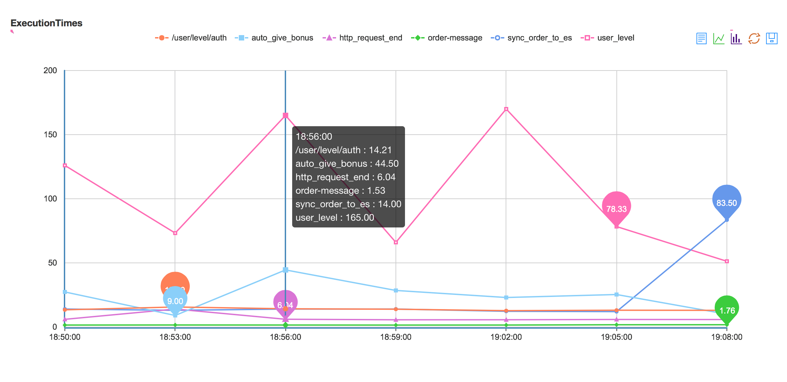

# perf4j
Performance Monitoring and Statistics for Java Code

重写per4j的图表渲染，由google的chartApi改为baidu的Echart图表

google网站并不是每个人都可以访问，但自己又不想放弃perf4j这款轻量方便的组件，它可以和常用的日志系统如log4j，logback集成，所以为了继续使用它，图表渲染的功能
修改为baidu的Echart，更适合我们国内企业和开发人员的使用

另外，它的官网也不在对外开放，使用方式我会按照我目前知道的写个简单的介绍

新的图表渲染样式如下

