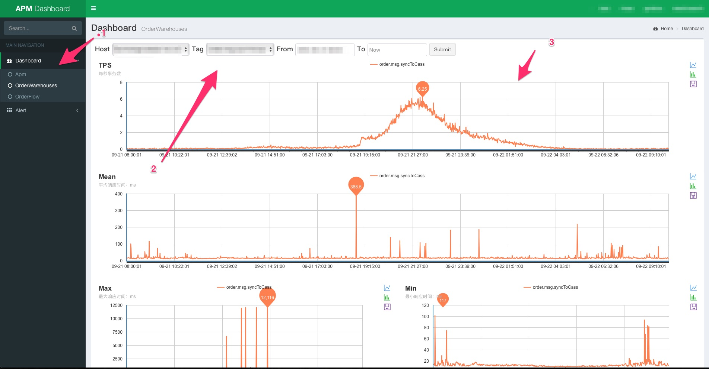
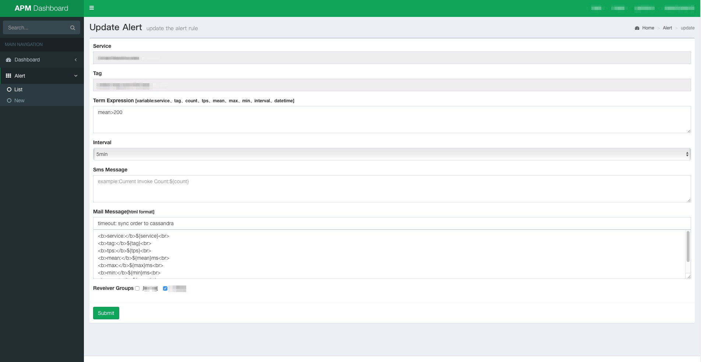

基于MySql数据源的展示与预警平台
-------------------
apm-dashboard是一个基于MySql数据源的预警平台，同时也可以查看查看简单的数据图表。在启动该项目前你需要设置MySql的数据源，可以在apm-dashboard
的根目录下设置conf.properties

```
# datasource
datasource.url=jdbc:mysql://127.0.0.1:3306/test3?useUnicode=true&amp;characterEncoding=utf8&amp;useSSL=false
datasource.user=root
datasource.password=
```

然后在apm-dashboard目录通过下面`mvn jetty:run`的方式启动，你也可以在生成环境下打成war包的形式启动，建议测试时用mvn jetty:run的方式启动。



1. 服务注册列表，该信息是通过读取APM_SERVICE表获取
2. 选择指定的Tag指定的时间区域展示数据，注意MySql的聚合能力有限，不要跨度太大，该数据会从APM_STATISTICS_${service}中读取
3. 性能指标：TPS(每秒钟调用量)、Mean(平均响应时间)、Max(最大响应时间)、Min(最小响应时间)、Count(聚合周期内，调用总数)、Std(响应时间标准方差)

### 使用预警



#### 语法支持

你可以为每一个tag创建一个Alert规则，语法支持jexl表达式，语法说明：[http://commons.apache.org/proper/commons-jexl/reference/syntax.html](http://commons.apache.org/proper/commons-jexl/reference/syntax.html)。

#### 变量说明
- service：服务名
- tag：tag
- count: interval周期内调用次数
- tps： 每秒钟的调用次数
- mean：interval周期内平均响应时间
- max： interval周期内的最大响应时间
- min： interval周期内的最小响应时间
- datatime： 报警时间

#### 消息通知与人群获取

>消息支持短信、邮件，需要实现这个接口：com.peaceful.apm.alert.impl.MsgHandler

>获取用户组需要实现该接口：com.peaceful.apm.dashboard.service.UserService

实现后，在conf.properties配置实现类全名，可以参考测试实现类：com.peaceful.apm.alert.impl.NopMsgNotice、com.peaceful.apm.dashboard.service.NopUserService


