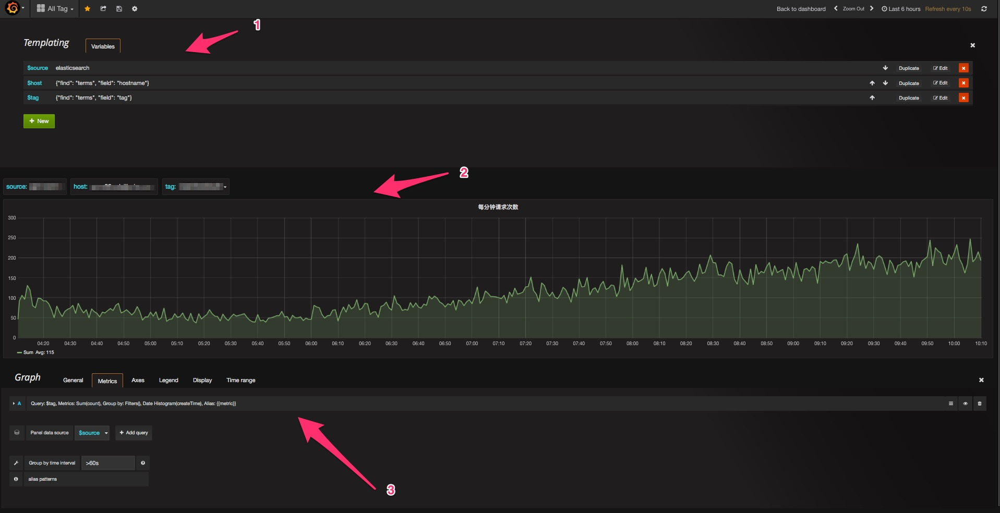

基于ElasticSearch数据源和Grafa图表的展示平台
--------

Grafana是一个前端的图表展示项目，它有漂亮的外衣，支持多种图表类型、可以自定义图表、可以自定义Dashboard，器底层也支持多种数据源。这里只要是介绍基于ElasticSearch数据源的使用。

### ElasticSearch数据源

#### 版本

提供的ElasticSearch数据导入是基于1.x的版本，在实际生产环境中用的是1.6.0的版本。注意2.x的版本因为一些api接口变化不兼容1.x版本，如果需要升级到2.x版本，可以重写ElasticService类

#### 索引策略

在前面介绍数据导入elasticsearch时，需要配置indexPrefix字段，这里是数据存储的一个策略方案：

- 不同的集群服务设置不同的indexPrefix,这样可以根据服务名称创建不同的索引
- 索引的创建除了按照上述根据服务名外，还将根据月份创建，每月创建一个索引

这应该是很成熟的数据存储策略，可以让我们清晰明了的管理我们的索引数据，根据不同的服务不同的索引名且按照时间划分索引数据也利于快速的查询和数据聚合。

### Grafana

Grafana支持很多功能配置，上图展示的主要是主要用到的特性

1. 设置变量，比如所有Service、每个Service下的节点、每个节点下的Tag
2. 图表展示区域，可以支持多种图表显示方式和数据类型展示
3. 图表具体设置区域，可以设置数据的查询语句、图表的定制配置

>Grafana：[http://grafana.org](http://grafana.org)
>ElasticSearch:[https://www.elastic.co](https://www.elastic.co)